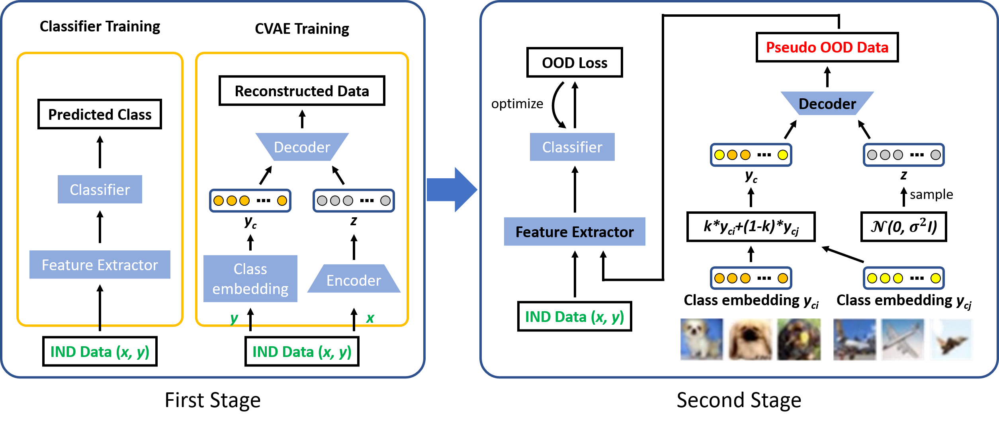

# CMG: A Class-Mixed Generation Approach to Out-of-Distribution Detection

This repository contains the code for our ECML'22 paper CMG: A Class-Mixed Generation Approach to Out-of-Distribution
Detection by Mengyu Wang*, Yijia Shao*, Haowei Lin, Wenpeng Hu, and Bing Liu.

## Overview

We propose CMG (*Class-Mixed Generation*) for efficient out-of-distribution (OOD) detection. CMG uses CVAE to generate
pseudo-OOD training samples based on class-mixed information in the latent space. The pseudo-OOD data are used to
fine-tune a classifier in a 2-stage manner. By using different loss functions, we propose two versions of the CMG
system, CMG-softmax (CMG-s) and CMG-energy (CMG-e). The figure below illustrates our CMG system.



## Requirements

### Environments

The required packages are as follows:

- python 3.5
- torch 1.2
- torchvision 0.4
- CUDA 10.0
- scikit-learn 0.22

### Datasets

For Setting 1 - OOD Detection on the Same Dataset, this repository supports MNIST and CIFAR10 which can be directly
downloaded through `torchvision`.

For Setting 2 - OOD Detection on Different Datasets, this repository supports CIFAR10 as IND data and SVHN / LSUN /
tinyImageNet / LSUN-FIX / ImageNet-FIX / CIFAR-100 as OOD data. SVHN and CIFAR 100 can be directly downloaded
through `torchvision`. The remaining data have been processed by the CSI paper and you can download
them [here](https://github.com/alinlab/CSI).

Please download datasets to [./datasets](./datasets) and rename the file. See [./datasets/datasetsHelper.py](./datasets/datasetsHelper.py) and our paper for more details.

## Training CMG

### CMG Stage 1

CMG Stage 1 involves IND classifier building and CVAE training.

The standard code is running with a single GPU and you can assign a specific GPU in the command line.

For more details, please view [utils.py](./utils.py).

#### Train IND classifier

To train IND classifier on MNIST for Setting 1, run this command:

```
python -m train \
  --task 'same_dataset_mnist' \
  --partition {'partition1'/'partition2'/'partition3'/'partition4'/'partition5'} \
  --command 'train_classifier' \
  --device {the available GPU in your cluser, e.g., cuda:0} \
  --params-dict-name {checkpoint name, e.g., './ckpt/main_model_partition1.pkl'}
```

To train IND classifier on CIFAR10 for Setting 1, run this command:

```
python -m train \
    --task 'same_dataset_cifar10' \
    --partition {'partition1'/'partition2'/'partition3'/'partition4'/'partition5'} \
    --command 'train_classifier' \
    --device {the available GPU in your cluser, e.g., cuda:0} \
    --params-dict-name {checkpoint name, e.g., './ckpt/main_model_partition1.pkl'}
```

To train IND classifier on CIFAR10 for Setting 2, run this command:

```
python -m train \
    --task 'different_dataset' \
    --command 'train_classifier' \
    --device {the available GPU in your cluser, e.g., cuda:0} \
    --params-dict-name {checkpoint name, e.g., './ckpt/main_model_different_dataset.pkl'}
```

#### Train CVAE

To train CVAE on MNIST for Setting 1, run this command:

```
python -m train \
    --task 'same_dataset_mnist' \
    --partition {'partition1'/'partition2'/'partition3'/'partition4'/'partition5'} \
    --command 'train_cvae' \
    --device {the available GPU in your cluser, e.g., cuda:0} \
    --params-dict-name {checkpoint name, e.g., './ckpt/cvae_partition1.pkl'}
```

To train CVAE on CIFAR10 for Setting 1, run this command:

```
python -m train \
    --task 'same_dataset_cifar10' \
    --partition {'partition1'/'partition2'/'partition3'/'partition4'/'partition5'} \
    --command 'train_cvae' \
    --device {the available GPU in your cluser, e.g., cuda:0} \
    --params-dict-name {checkpoint name, e.g., './ckpt/cvae_partition1.pkl'}
```

To train CVAE on CIFAR10 for Setting 2, run this command:

```
python -m train \
    --task 'different_dataset' \
    --command 'train_cvae' \
    --device {the available GPU in your cluser, e.g., cuda:0} \
    --params-dict-name {checkpoint name, e.g., './ckpt/cvae_different_dataset.pkl'}
```


### CMG Stage 2 and Evaluation

To perform CMG Stage 2 and get the final result on MNIST for Setting 1, run this command:

```
python -m eval \
    --task 'same_dataset_mnist' \
    --partition {'partition1'/'partition2'/'partition3'/'partition4'/'partition5'} \
    --device {the available GPU in your cluser, e.g., cuda:0} \
    --params-dict-name {main model checkpoint name} \
    --params-dict-name2 {cvae checkpoint name} \
    --mode {'CMG-energy'/'CMG-softmax'}
```

To perform CMG Stage 2 and get the final result on CIFAR10 for Setting 1, run this command:

```
python -m eval \
    --task 'same_dataset_cifar10' \
    --partition {'partition1'/'partition2'/'partition3'/'partition4'/'partition5'} \
    --device {the available GPU in your cluser, e.g., cuda:0} \
    --params-dict-name {main model checkpoint name} \
    --params-dict-name2 {cvae checkpoint name} \
    --mode {'CMG-energy'/'CMG-softmax'}
```

To perform CMG Stage 2 and get the final result on CIFAR10 for Setting 2, run this command:

```
python -m eval \
    --task 'different_dataset' \
    --ood-dataset {'SVHN'/'LSUN'/'LSUN-FIX'/'tinyImageNet'/'ImageNet-FIX'/'CIFAR100'}
    --device {the available GPU in your cluser, e.g., cuda:0} \
    --params-dict-name {main model checkpoint name} \
    --params-dict-name2 {cvae checkpoint name} \
    --mode {'CMG-energy'/'CMG-softmax'}
```

## Apply CMG to CSI

CMG is a training paradigm orthogonal to existing OOD detection models and can enhance existing systems to further
improve their performance (please see our paper for details).

Here we also provide codes to reproduce the new SOTA by applying CMG to [CSI](https://github.com/alinlab/CSI).
See [./CSI+CMG](./CSI+CMG).

## Acknowledgements

We thank [CSI](https://github.com/alinlab/CSI) for providing downloaded links for their processed data and our "CSI+CMG"
code is also based on their implementation.